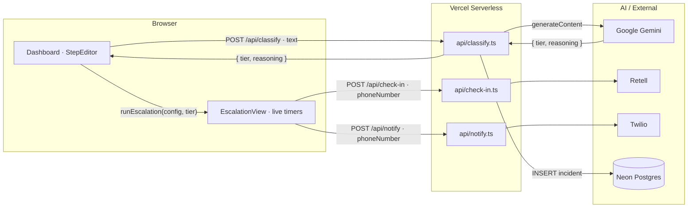
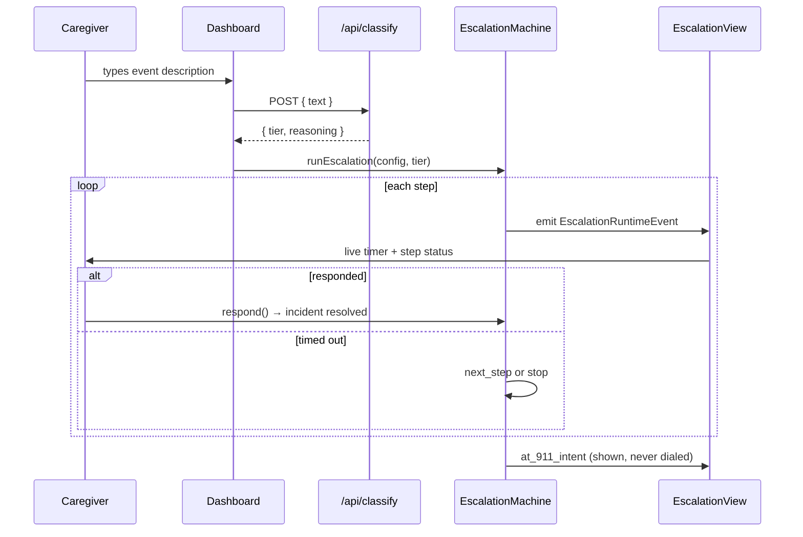

<div align="center">

# GuardianAlert

**An intelligent escalation layer for elder-care detection systems** that accepts a free-text "something's off" event, classifies it with AI into a severity tier — minor, medium, or major — with **visible reasoning**, then runs a **user-configured escalation procedure** step by step with live timers until a human takes ownership.

<br/>


<br/>

</div>

---

**Hackathon:** AgeTech SF Hackathon 2026<br/>
**Team:** Logesh Rajendran, Vanessa Lopez, Volodymyr Borysenko<br/>
**Live demo:** [guardianAlert on Vercel](https://age-tech-hackathon-1.vercel.app)

---

## The Problem

**14.7 million** older adults live alone in the US. Smart home devices and wearables have become good at detecting falls and inactivity — but detection alone does not make anyone safe. The gap between a sensor firing and a human confirming someone is okay has remained largely unaddressed.

When an emergency happens at 2 AM, a family member scrambling to call through a contacts list is not a reliable response plan. **GuardianAlert closes that gap**: a caregiver describes what they're seeing, AI grades the severity and explains why, and a structured escalation procedure runs automatically — voice check-in, contacts, emergency services — until someone takes ownership.

911 is shown as intent only. No real number is ever dialed.

---

## Built With

| Area | Stack |
|------|-------|
| **Frontend** | React 19 · TypeScript (strict) · Tailwind CSS v4 · Vite |
| **Serverless API** | Vercel Functions (`api/*.ts`) · `@vercel/node` |
| **AI Classifier** | Google Gemini (`gemini-2.0-flash` → `gemini-2.0-flash-lite` fallback) via `@google/genai` |
| **Voice check-in** | Retell SDK — simulated without `RETELL_API_KEY` |
| **Contact notify** | Twilio — gracefully skipped without credentials |
| **Incident logging** | Neon Postgres (`@neondatabase/serverless`) — optional, zero-downside if absent |

---

## Architecture at a Glance



### End-to-end escalation cycle



---

## The Escalation Engine

The core state machine (`src/engine/escalationMachine.ts`) is **pure TypeScript with no React dependency** — fully unit-testable. It:

1. Reads the user-built `EscalationConfig` — one ordered `TierProcedure` per severity tier.
2. Walks steps in array order, emitting an `EscalationRuntimeEvent` on every tick.
3. Fires real side-effects (Retell voice call, Twilio contact notify) when a step has a `phoneNumber`.
4. Exposes a `MachineHandle` with `stop()` and `respond()` — the only two ways to interrupt a run.

### Step types

| Type | What happens |
|------|-------------|
| `voice_call` | AI agent calls the elder directly via Retell. If they pick up and confirm they're OK, escalation stops immediately. |
| `contact` | Notification call placed to the named emergency contact via Twilio. |
| `call_911` | Renders the 911 intent state on screen. No real call is ever placed. |

### Default escalation order (user-configurable)

| Tier | Step 1 | Step 2 | Step 3 |
|------|--------|--------|--------|
| **Minor** | AI voice call to elder | Notify contact | — |
| **Medium** | AI voice call to elder | Notify contact 1 | Notify contact 2 |
| **Major** | AI voice call to elder | Notify contact | 911 intent |

---

## Dashboard

- **Classify with AI** — paste or type any free-text event; Gemini returns `{ tier, reasoning }` with the reasoning shown on screen, not just the label.
- **Scenario presets** — 8 one-click judge-ready inputs covering all three tiers, pre-loaded from the landing page.
- **Live escalation view** — step timeline with per-step countdown timers, color-coded status (active / responded / timed out), and a context-aware respond button:
  - Voice call active → *"They picked up, they're OK"*
  - Contact step active → *"Contact confirmed they're OK"*
- **Stop button** — halts the entire run at any point.
- **Step editor** — reorder steps, set timeouts, change targets, add or remove steps per tier. Order recommendations and safety warnings (e.g. 911 before contacts) shown inline.

---

## What Makes This an Agent?

| Property | How it shows here |
|----------|------------------|
| **Perceives** | Free-text care event from caregiver or sensor system |
| **Decides** | Gemini classifies severity; visible reasoning surfaces the why |
| **Acts** | State machine walks user-configured steps in order with real timers |
| **Adapts to feedback** | `respond()` short-circuits escalation the moment a human confirms safety |
| **Resilient** | Retell/Twilio/Neon all optional; keyword fallback classifier if Gemini is unavailable |

---

## Project Structure

```
AgeTech-Hackathon-1/
├── api/
│   ├── classify.ts           # Vercel function · Gemini classifier · Neon incident log
│   ├── check-in.ts           # Retell voice call proxy
│   ├── notify.ts             # Twilio contact notification proxy
│   └── call-status.ts        # Call status polling
├── src/
│   ├── types/
│   │   ├── escalation.ts     # Shared frozen schema — EscalationConfig, step types, runtime events
│   │   └── classifier.ts     # Classifier output shape
│   ├── engine/
│   │   └── escalationMachine.ts    # Pure TS state machine · no React
│   ├── lib/
│   │   ├── classify.ts       # Client wrapper for /api/classify
│   │   └── notify.ts         # Client wrappers for Retell / Twilio APIs
│   ├── components/
│   │   ├── Navbar.tsx         # Page navigation (landing ↔ dashboard)
│   │   ├── HeroSection.tsx    # Landing hero with Spline fallback
│   │   ├── OverviewPage.tsx   # Problem stats + how-it-works + scenario cards
│   │   ├── Dashboard.tsx      # Incident input + AI result panel
│   │   ├── StepEditor.tsx     # Per-tier step editor with order validation
│   │   └── EscalationView.tsx # Live step timeline with timers
│   ├── App.tsx                # Page state · classify · machine wiring
│   └── main.tsx
├── public/
│   └── logo.jfif
├── vercel.json
└── package.json
```

---

## Quick Start

```bash
git clone https://github.com/TarunYadgirkar/AgeTech-Hackathon-1.git
cd AgeTech-Hackathon-1
npm install
```

### Environment variables

Create a `.env` in the project root:

```bash
# Required — AI classifier
GEMINI_API_KEY=your_gemini_api_key

# Optional — Retell voice check-in (gracefully skipped if absent)
RETELL_API_KEY=
RETELL_AGENT_ID=
RETELL_FROM_NUMBER=

# Optional — Twilio contact notifications (gracefully skipped if absent)
TWILIO_ACCOUNT_SID=
TWILIO_AUTH_TOKEN=
TWILIO_FROM_NUMBER=

# Optional — Neon Postgres incident logging (gracefully skipped if absent)
DATABASE_URL=
```

### Run locally with the serverless API

```bash
vercel dev
```

Opens at **[http://localhost:3000](http://localhost:3000)** with `/api/*` routes live.

### Run frontend only

```bash
npm run dev
```

Classification will fail without the API, but the escalation engine and UI work against mock data.

### Production build

```bash
npm run build
npm run preview
```

### Deploy to Vercel

```bash
npx vercel --prod
```

Set `GEMINI_API_KEY` as a Vercel environment variable. All other vars are optional.

---

<div align="center">

**Built with React, TypeScript, Gemini, and the belief that detection without follow-through is not safety.**

</div>
